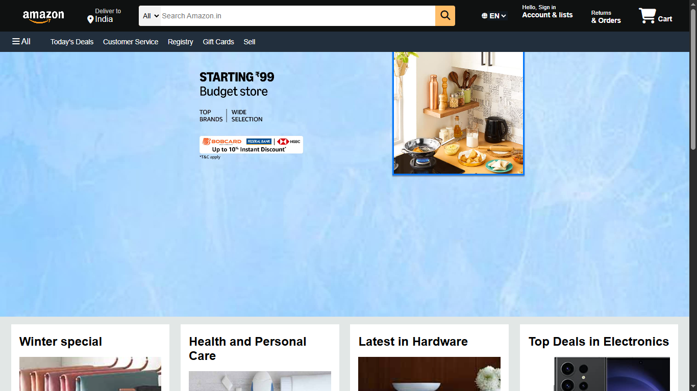
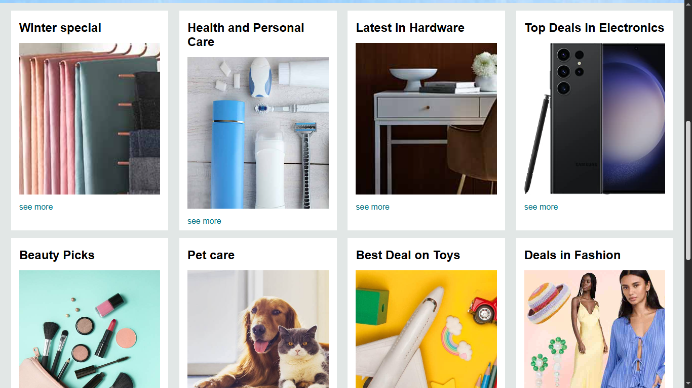
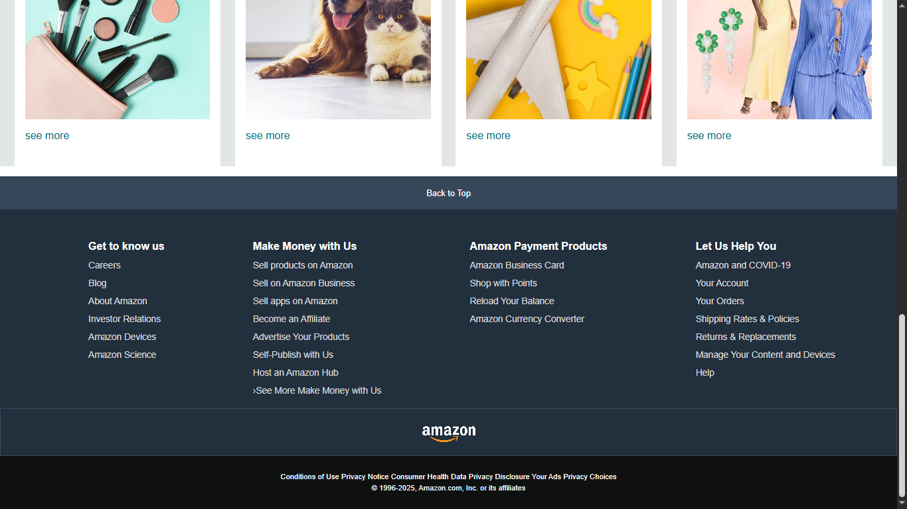

# Amazon UI Clone

## Overview

A front-end clone of Amazon's homepage built using HTML5 and CSS3. This project focuses on recreating the visual design and layout of Amazon's user interface while strengthening core front-end development skills such as page structuring, styling, layout management, and semantic HTML practices.

The project was developed for learning purposes and demonstrates the implementation of a real-world website design using only HTML and CSS.

## Live Demo

🔗 https://subham-063.github.io/Amazon-UI-UX-Clone/

## Screenshots

### Homepage



### Product Section



### Footer Section



## Features

* Amazon-inspired navigation bar
* Search bar UI
* Language selection section
* Hero banner section
* Product showcase cards
* Multi-column footer
* Semantic HTML structure
* CSS Flexbox-based layouts
* Font Awesome integration
* Back to Top navigation link

## Technologies Used

* HTML5
* CSS3
* Font Awesome

## Project Structure

```text
Amazon-Clone/
│
├── images/
│   ├── amazon_logo.png
│   ├── box1_image.jpg
│   ├── box2_image.jpg
│   ├── box3_image.jpg
│   ├── box4_image.jpg
│   ├── box5_image.jpg
│   ├── box6_image.jpg
│   ├── box7_image.jpg
│   ├── box8_image.jpg
│   ├── hero_image.jpg
│   └── hero1.jpg
│
├── screenshots/
│   ├── homepage1.jpg
│   ├── homepage2.jpg
│   └── homepage3.jpg
│
├── index.html
├── styles.css
└── README.md
```

## Learning Outcomes

Through this project, I gained practical experience in:

* Semantic HTML structuring
* CSS Flexbox layouts
* UI replication and styling
* Component-based design organization
* Working with external icon libraries
* Layout spacing and positioning techniques
* Building real-world front-end interfaces

## Challenges Faced

* Replicating Amazon's navigation layout
* Maintaining visual consistency across sections
* Structuring reusable CSS styles
* Creating complex layouts using only HTML and CSS
* Implementing proper semantic HTML elements

## Future Enhancements

* [ ] Add JavaScript functionality for interactivity
* [ ] Implement search bar functionality
* [ ] Create product detail pages
* [ ] Add shopping cart features
* [ ] Improve accessibility standards
* [ ] Enhance responsiveness for tablets and mobile devices

## Installation

Clone the repository:

```bash
git clone https://github.com/Subham=-063/Amazon-UI-UX-Clone.git
```

Navigate to the project directory:

```bash
cd Amazon-UI--UX-Clone
```

Open `index.html` in your preferred browser.

## Author

**Subham**

GitHub: https://github.com/Subham-063

## Disclaimer

This project is intended solely for educational and learning purposes. Amazon and all related trademarks are the property of their respective owners. This project is not affiliated with, endorsed by, or associated with Amazon.
